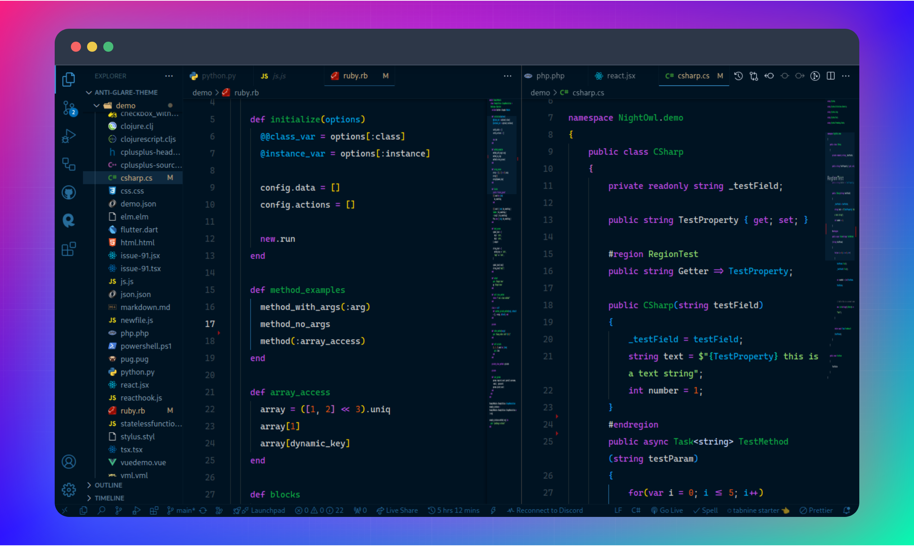
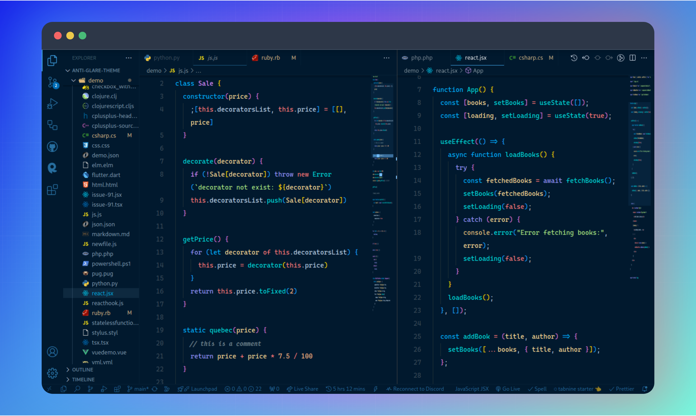
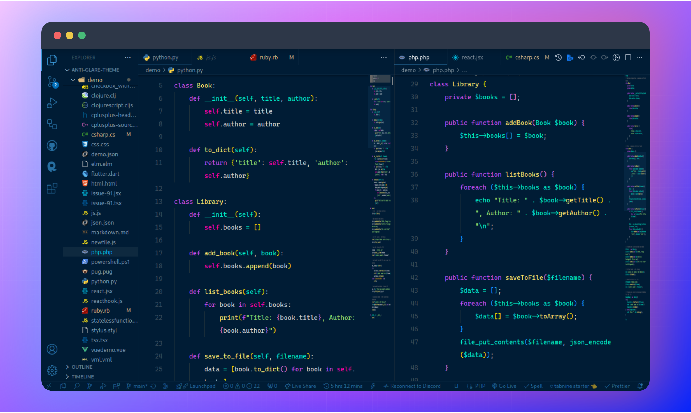

# ✨ Anti-Glare Theme

It might be the best choice for those who can't see the code editor in low light. It's tailored to the needs of those of us who love to code late into the night.

## 🔸 Table of contents

-   [Theme Screenshots](#theme-screenshots)
-   [Getting started](#getting-started)
    -   [Prerequisites](#prerequisites)
    -   [Installation](#installation)
-   [Activate theme](#activate-theme)
-   [Recommended settings](#recommended-settings-for-a-better-experience)
-   [Included settings](#Included-settings-for-a-better-experience)

## 🔸 Theme Screenshots

### 🔸 Anti-Glare - Official


### 🔸 Anti-Glare - Moonlit


### 🔸 Anti-Glare - Nebula


## 🔸 Getting started

You can install this awesome theme through the [Visual Studio Code Marketplace](https://marketplace.visualstudio.com/items?itemName=azmarifdev.anti-glare-theme).

### 🔸 Prerequisites

This theme is compatible for VS Code version 1.16.0+

### 🔸 Installation

Launch _Quick Open_:

-    <a href="https://code.visualstudio.com/shortcuts/keyboard-shortcuts-linux.pdf">Linux</a> `Ctrl+P`
-    <a href="https://code.visualstudio.com/shortcuts/keyboard-shortcuts-macos.pdf">macOS</a> `⌘P`
-    <a href="https://code.visualstudio.com/shortcuts/keyboard-shortcuts-windows.pdf">Windows</a> `Ctrl+P`

Paste the following command and press `Enter`:

```shell
ext install anti-glare-theme
```

And pick the one by **A. Z. M. Arif** as author.

## 🔸 Activate theme

Launch _Quick Open_:

-    <a href="https://code.visualstudio.com/shortcuts/keyboard-shortcuts-linux.pdf">Linux</a> `Ctrl + Shift + P`
-    <a href="https://code.visualstudio.com/shortcuts/keyboard-shortcuts-macos.pdf">macOS</a> `⌘ + Shift + P`
-    <a href="https://code.visualstudio.com/shortcuts/keyboard-shortcuts-windows.pdf">Windows</a> `Ctrl + Shift + P`

Type `theme`, choose `Preferences: Color Theme`, and select _Anti-Glare Theme_ from the list. After activation, the theme will be activated.

## 🔸 Recommended settings for a better experience

First, _Download_ and _Install_ Recommended fonts from here: [Click me](https://github.com/azmarifdev/vsfonts/).
After that, add the following codes to the `settings.json`

```js
{
    // Controls the editor font family.
    "editor.fontFamily": "Operator-Caska",
    // Controls the terminal font family.
    "terminal.fontFamily": "CaskaydiaCove Nerd Font Mono"
}
```

## 🔸 Included settings for a better experience

I have included some required settings in this theme. Therefore, this theme will be more suitable for night coding. Here are the settings.

<details>
  <summary><b>🔰 Expand me</b></summary>

```js
{
    "editor.lineHeight": 2,
    "editor.cursorBlinking": "expand",
    "editor.cursorWidth": 2,
    "editor.fontSize": 14.5,
    "editor.hover.delay": 700,
    "editor.linkedEditing": true,
    "editor.snippetSuggestions": "top",
    "editor.roundedSelection": true,
    "editor.formatOnSave": true,
    "editor.mouseWheelScrollSensitivity": 2,
    "diffEditor.wordWrap": "on",
    "diffEditor.ignoreTrimWhitespace": true,
    "editor.suggestSelection": "first",
    "editor.accessibilitySupport": "off",
    "editor.find.addExtraSpaceOnTop": false,
    "editor.fontLigatures": true,
    "editor.find.cursorMoveOnType": true,
    "editor.formatOnType": true,
    "editor.formatOnPaste": true,
    "editor.renderLineHighlight": "none",
    "editor.scrollbar.verticalScrollbarSize": 8,
    "editor.scrollbar.horizontalScrollbarSize": 8,
    "editor.scrollbar.horizontal": "auto",
    "editor.smoothScrolling": true,
    "editor.scrollbar.scrollByPage": true,
    "editor.foldingImportsByDefault": true,
    "editor.minimap.renderCharacters": true,
    "editor.minimap.maxColumn": 50,
    "editor.minimap.showSlider": "always",
    "editor.minimap.size": "fill",
    "editor.cursorSmoothCaretAnimation": "on",
    "editor.overviewRulerBorder": false,
    "editor.hideCursorInOverviewRuler": true,
    "editor.bracketPairColorization.enabled": true,
    "editor.quickSuggestions": {
        "comments": true,
        "strings": true
    },
    "terminal.integrated.cursorWidth": 2,
    "terminal.integrated.cursorStyle": "underline",
    "terminal.integrated.cursorBlinking": true,
    "terminal.integrated.lineHeight": 1.2,
    "terminal.integrated.letterSpacing": 1,
    "terminal.integrated.fontSize": 13,
    "terminal.integrated.allowMnemonics": true,
    "terminal.integrated.copyOnSelection": false,
    "terminal.integrated.fastScrollSensitivity": 4,
    "terminal.explorerKind": "both",
    "terminal.integrated.enableMultiLinePasteWarning": "auto",
    "terminal.integrated.enableVisualBell": true,
    "terminal.sourceControlRepositoriesKind": "both"
}
```
</details>

#

🌟 BTW, If you want to know about me then go here: [azmarif.dev](https://azmarif.dev/)

---

<p align="center">Copyright &copy; 2024 A. Z. M. Arif</p>

